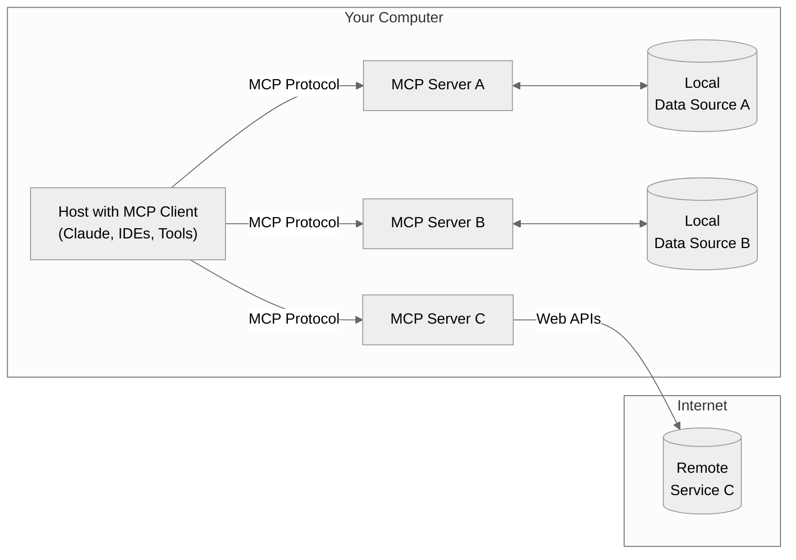

# Model Context Protocol (MCP)
## Security Guidelines 
*(Version 1.0) Author: Amit Sharma*

### Introduction 

Model Context Protocol (MCP) functions as an open standard which improves artificial intelligence system connectivity to external tools, prompts, and data sources. The real-time operational environment benefits from MCP through its establishment of a unified declarative framework for AI agents. MCP serves as the fundamental building block for multi-agent and dynamic AI workflows across distributed architectures.

The document explains MCP elements and their architectural methods together with security challenges, protective measures, operational guidelines, and mitigations.  

### Scope 

This document provides guidelines for developing and operating Model Context Protocol (MCP) based systems and architectures while ensuring security, scalability, and responsible operations. The guidelines follow industry standards for AI risk management and governance through ISO/IEC 42001:2023 Artificial Intelligence Management System (AIMS) and OWASP Top 10 for LLM, Generative AI, and Agentic Risk and Threat Modeling frameworks to build trustworthiness and fairness alongside security and privacy and accountability.

### Audience

This document provides comprehensive guidance for senior leadership, technical leaders, Chief Information Security Officers, Chief Data Officers, AI Architects, and program managers who need to provide oversight for AI initiatives.

The document starts with basic MCP knowledge before moving to prescriptive guidance for executives who want to lead teams and distribute resources while maintaining security alignment with business targets.

### Rationale for MCP Adoption

MCP solves the M×N integration challenge by using a single unified protocol instead of many individual APIs for connecting multiple AI agents with various tools. The abstraction layer provides model inference independence from execution, which results in the following:

- Runtime flexibility for agentic decision-making.
- The framework allows organizations to enforce policies on third-party tools through its governance mechanisms.
- Improved audibility and risk visibility.
- Seamless scale across teams, clouds, and workflows.

**Figure 1**

### MCP Use (or Not Use) Decision

MCP presents organizations with a new attack surface and security threats, therefore, users must check the following guidance before proceeding to the next steps in their MCP adoption journey.

| Requirement   | Yes           |No           |
| ------------- | ------------- |-------------|
| 1.	The AI workflow demands dynamic multi-tool and agent-based orchestration  | Proceed to Q2  |Use static orchestrators (e.g., Airflow, Step Functions)| 
| 2.	The workflow operates entirely within internal boundaries without interactive elements and maintains strict fixed flows  | Do not use MCP  | Proceed to Q3| 
| 3.	Tools/agents access sensitive data or production systems  | Proceed to Q4  |Use MCP with moderate - high guardrails| 
| 4.	The tools/agents need to be registered or modified at runtime  | Proceed to Q5  | Use manifest-based orchestration| 
| 5.	All essential security measures, including signed manifests and metadata scanning, prompt I/O sanitization, per-tool RBAC, sandboxing, and syscall filters are implemented| Proceed to Q6  | Do not use MCP| 
| 6.	The selection of tools depends on natural language inputs and untrusted UIs | Proceed to Q7  | MCP acceptable with monitoring and quotas| 
| 7.	The system enables real-time monitoring to detect tool hijacking and prompt injection and lateral movement and impersonation and data exfiltration and kill-switch functionality | Proceed to Q8 | Do not use MCP| 
| 8.	Users can bring external tools or agents | Enforce SBOM, SLSA L3+, Sandboxing  | Proceed to Q9| 
| 9.	The process of goal setting and agent-chaining requires human review of all decisions | Proceed to Q10  | Use MCP with fallback validation and heuristics| 
| 10.	Golden controls (ISO 42001, NIST AI RMF, OWASP Agentic) in place | Use MCP with lifecycle controls  | Implement controls first or delay MCP adoption | 

Note: The decision to use (or not use) MCP largely depends on organizations’ AI security and governance maturity.
